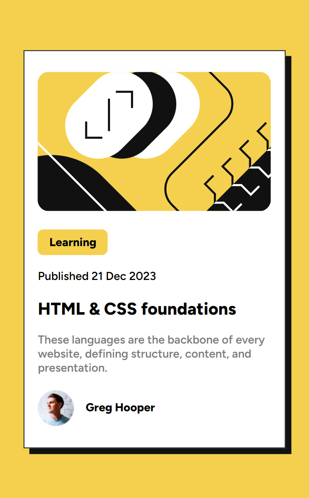
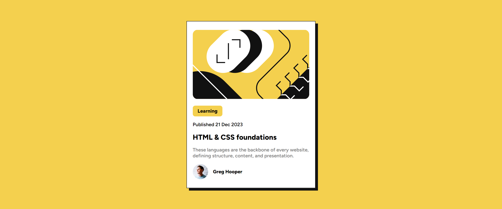

# Frontend Mentor - Blog preview card solution

This is a solution to the [Blog preview card challenge on Frontend Mentor](https://www.frontendmentor.io/challenges/blog-preview-card-ckPaj01IcS). 

## Table of contents

- [Overview](#overview)
  - [The challenge](#the-challenge)
  - [Screenshot](#screenshot)
  - [Links](#links)
- [My process](#my-process)
  - [Built with](#built-with)
  - [What I learned](#what-i-learned)
  - [Continued development](#continued-development)
  - [Useful resources](#useful-resources)
- [Author](#author)
- [Acknowledgments](#acknowledgments)


## Overview

### The challenge

Users should be able to:

- See hover and focus states for all interactive elements on the page

### Screenshot





### Links

- Solution URL: (https://github.com/WeiXinToo/frontend-mentor-weixin)
- Live Site URL: (https://weixintoo.github.io/frontend-mentor-weixin/blog-preview-card/)

## My process

### Built with

- Semantic HTML5 markup
- CSS variables
- Flexbox
- Mobile-first workflow


### What I learned

This is my first project in Frontend Mentor and I started to put my learning from various sources into practice and started to make sense of frustrating css concept like width, height, flex and so much more. Here are some of the takeaways from this project:

1. I learn to analyse design and plan how I would write my html code and css before jumping right into the project and it indeed saves me a lot of time. 
2. I learn to use semantic html tags instead of divs that is very confusing if we have too much of it.
3. I learn to use variable in css so that I can reuse some of my code, and it makes maintenance so much easier. For example, multiple places need the same color.
4. I learn how to play with width and height property, position - absolute, and layout like flexbox in css.

```html
<main>
      <!--Learn to use semantic html like main and figure instead of meaningless div element as container.-->
      <figure class="illustration-container"></figure>
    
   
      <p class="yellow-tag">Learning</p>
      <p>Published 21 Dec 2023</p>
      <p class="title">HTML & CSS foundations</p>
      <p class="text">These languages are the backbone of every website, defining structure, content, and presentation.</p>
    

      <figure class="avatar-container">
        
        <figcaption class="avatar-name">Greg Hooper</figcaption>
      </figure>
      
    
  </main>
```
```css
/*Modify root element font-size by converting it to 10px for easy calculation when using relative units like em or rem.*/

html {
  font-size: 62.5%;
}

/*Use variables to make css more reusable.*/
:root {
  /*COLORS*/
  --BGCOLOR: hsl(47, 88%, 63%);
  --COLOR1: hsl(0, 0%, 100%);
  --COLOR2: hsl(0, 0%, 50%);
  --COLOR3: hsl(0, 0%, 7%);
  ...
}

/*
- Learn how to vertically center a container using position and transform
- Learn to use width, max-width, height to retain the design size I want when resizing.
*/
main {
  /*Center vertically*/
  position: absolute;
  top: 50%;
  left: 50%;
  transform: translate(-50%, -50%);
  
  /*Center Horizontally*/
  padding: var(--PADDING-MAIN);
  width: 85%;
  max-width: 370px;
  height: 80dvh;
}
```

### Continued development

My next step would be learning more css techniques like media queries, container queries that can make responsive web design easier. I also want to further consolidate my knowledge with position, transform, layout, animation by practising them during leisure time. Besides, I plan to start learning JavaScript and DOM Manipulation to make my future project interactive.


### Useful resources

- [Introduction To Responsive Web Design - HTML & CSS Tutorial](https://www.youtube.com/watch?v=srvUrASNj0s&t=489s) - This video further consolidates my understanding of responsive web design and other topics like width, max-width, and min-width to achieve desired styles I want.
- [4 ways to deal with overflowing text](https://www.youtube.com/watch?v=6Nv0weHy7t0) - This video from Kevin Powell taught how to deal with annoying overflowing when styling webpage with css, I implemented one of the solution and it solved the issue and I am happy with that.
- [Learn HTML – Full Tutorial for Beginners (2022)](https://www.youtube.com/watch?v=kUMe1FH4CHE) - This video made by Dave Gray and shared by FreeCodeCamp lets me understand basic html and learn semantic tags.
- [CSS Tutorial – Full Course for Beginners](https://www.youtube.com/watch?v=OXGznpKZ_sA&t=32388s) - This video gets me started with all the basic css before starting this project.
- [HTML & CSS Full Course - Beginner to Pro](https://www.youtube.com/watch?v=G3e-cpL7ofc&t=9727s) - This video combines both tutorials and project-based learning and helped me a lot with how html and css works. I grasped the concept of layout like grid and flexbox here. Very recommended due to his teaching appraoch.


## Author
- Frontend Mentor - [@WeiXinToo](https://www.frontendmentor.io/profile/WeiXinToo)

## Acknowledgments

I would like to express my sincere gratitude towards two teacher from YouTube - Dave Gray, Kevin Powell, SuperSimpleDev, Web Dev Simplified and FreeCodeCamp for all the html and cs knowledge that makes this project possible.


